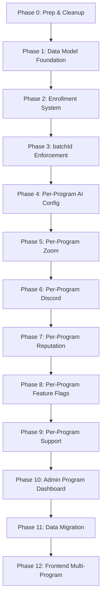

# Multi-Program Architecture Transformation — Implementation Plan

> **Goal:** Transform Yaksha FAQ Portal from a single-tenant FAQ + Q&A system into a scalable multi-program platform where a single admin manages multiple independent cohorts, each with its own FAQs, courses, Zoom insights, documents, AI settings, Discord bot, reputation system, feature flags, and support configuration.

---

## 🚨 Honest Assessment: Is This Project Out of Hand?

**Yes. Here's the evidence:**

### The Numbers Don't Lie

| Metric | Your Project | Typical MVP at this stage | Verdict |
|---|---|---|---|
| Total LOC | ~70,000 | ~15,000-25,000 | **3-4× overbuilt** |
| Mongoose Models | 37 | 8-12 | **3× too many** |
| Controllers | 55 | 15-20 | **3× too many** |
| Admin Pages | 28 | 8-10 | **3× too many** |
| Cron Jobs | 8 | 1-2 | **8× too many** |
| Migration Scripts | 7+ | 0-1 | **Accumulating debt** |
| `server.ts` | 521 lines | 50-80 lines | **God file** |
| `User.ts` | 303 lines | 50-80 lines | **God model** |

### Specific Red Flags

1. **Feature creep without architectural boundaries.** You have Golden Tickets, Spurti Points, Time Trials, Solution DNA, Freshness Tiers, Trust Levels, Objection Status, Promotion Metadata — all organically grown into monolithic models. Each feature added ~20 fields to existing schemas instead of being its own bounded context.

2. **The User model is a junk drawer.** [User.ts](file:///Users/yashhwanth/Documents/shamagama/backend/models/User.ts) (303 lines) contains: authentication, Zoom OAuth tokens, TOTP 2FA secrets, reputation points, tier system, Spurti Points, Golden Ticket cooldowns, welcome package tracking, onboarding audit logs, project assignments, mentor assignments, avatar, badges, bookmarks, moderation bans, golden bans, and more. This is a textbook God Object.

3. **No separation of concerns.** Controllers query the database directly. There's no repository layer, no service layer (except for a few AI services), no data access abstraction. This means every controller is its own island — there's no way to enforce cross-cutting concerns like `batchId` filtering automatically.

4. **Dual signal handlers.** [server.ts](file:///Users/yashhwanth/Documents/shamagama/backend/server.ts) registers `SIGTERM`/`SIGINT` handlers at BOTH line 480 and line 513. One does cleanup, the other does graceful shutdown. They'll race.

5. **Mixed enum casing.** `SupportStatus` has `'Pending'|'In Review'|'Resolved'|'Rejected'|'open'|'closed'` — TitleCase from v1.5 and lowercase from v1.65. This was flagged in v1.68 and deferred. It's still broken.

6. **Duplicate routes.** [App.tsx](file:///Users/yashhwanth/Documents/shamagama/frontend/src/App.tsx) line 200-201 registers `/admin/projects` twice.

7. **37 models with inconsistent scoping.** Only 9 of 37 models have `batchId`. The other 16 that SHOULD have it don't. This means every feature you've built operates as single-tenant even though the schema suggests multi-tenant.

8. **8 cron jobs with no orchestration.** Promotion (15min), freshness (24h), popularity (5min), retention (24h), auto-answer (configured), FAQ audit (6h), escalation (configured), Zoom retry (5min) — all running as `setInterval` in the same Node process with no health checking, no distributed locking, and no way to run them per-program.

### The Good News

Despite being "out of hand", the architecture isn't _broken_ — it's _outgrown its foundation_. The core concepts (Batch, Course, FAQ, Category, ProgramSettings) are well-designed. The batchId fields were forward-thinking. The codebase is consistently written in TypeScript with good error handling. The multi-program transformation below is a **reset point** — it takes the organic growth and channels it into a proper multi-tenant architecture.

### What "Getting It Under Control" Looks Like

1. **Phase 0 (below) is non-negotiable.** Decompose `server.ts` and `User.ts` before adding more features.
2. **Add a data access layer.** A `scopedQuery()` utility that automatically injects `batchId` into every Mongoose query is the single highest-leverage change.
3. **Stop adding fields to User.** Every new feature should be its own model with a `userId` foreign key.
4. **Formalize cron jobs.** Move from `setInterval` in `server.ts` to a proper scheduler (BullMQ repeatable jobs or a `crons/` module with health checks).

---

## Codebase Audit Summary

> [!IMPORTANT]
> **This project is at a critical inflection point.** It has grown organically to ~70k LOC across 37 models, 55 controllers, 30 route files, 28 admin pages, and 15 user pages. The `batchId` field exists on many models but is NOT enforced consistently — most queries don't filter by it, and many admin/user flows operate as if the system is single-tenant. Below is the full audit.

### Current State

| Metric | Count |
|---|---|
| Backend TypeScript LOC | ~36,344 |
| Frontend TSX/TS LOC | ~33,466 |
| Mongoose Models | 37 |
| Controllers | 55 |
| Route Files | 30 |
| Admin Pages | 28 |
| User Pages | 15 |
| npm scripts (backend) | 33 |
| Cron Jobs / Schedulers | 8 |
| Migration Scripts | 7+ |

### Models That Already Have `batchId`

| Model | `batchId` Status | Enforcement |
|---|---|---|
| [FAQ.ts](file:///Users/yashhwanth/Documents/shamagama/backend/models/FAQ.ts) | ✅ Has field | ⚠️ `required: false`, not filtered in all queries |
| [Category.ts](file:///Users/yashhwanth/Documents/shamagama/backend/models/Category.ts) | ✅ Has field | ✅ Indexed, used in queries |
| [Course.ts](file:///Users/yashhwanth/Documents/shamagama/backend/models/Course.ts) | ✅ Has field | ✅ Core to model |
| [CommunityPost.ts](file:///Users/yashhwanth/Documents/shamagama/backend/models/CommunityPost.ts) | ✅ Has field | ⚠️ `default: null`, not filtered in most reads |
| [SupportRequest.ts](file:///Users/yashhwanth/Documents/shamagama/backend/models/SupportRequest.ts) | ✅ Has field | ⚠️ `default: null`, optional |
| [ZoomMeeting.ts](file:///Users/yashhwanth/Documents/shamagama/backend/models/ZoomMeeting.ts) | ✅ Has field | ⚠️ `default: null`, not required |
| [DocumentInsight.ts](file:///Users/yashhwanth/Documents/shamagama/backend/models/DocumentInsight.ts) | ✅ Has field | ⚠️ `default: null` |
| [Batch.ts](file:///Users/yashhwanth/Documents/shamagama/backend/models/Batch.ts) | N/A (IS the batch) | ✅ |
| [ProgramSettings.ts](file:///Users/yashhwanth/Documents/shamagama/backend/models/ProgramSettings.ts) | ✅ `batchId` (1:1) | ✅ |

### Models That LACK `batchId` (Need Addition)

| Model | Risk | Notes |
|---|---|---|
| [User.ts](file:///Users/yashhwanth/Documents/shamagama/backend/models/User.ts) | 🔴 Critical | No program scoping at all. 303-line god model with Zoom tokens, TOTP, onboarding, reputation all mashed in |
| [AiConfig.ts](file:///Users/yashhwanth/Documents/shamagama/backend/models/AiConfig.ts) | 🔴 Critical | Single global AI config — no per-program AI settings |
| [Badge.ts](file:///Users/yashhwanth/Documents/shamagama/backend/models/Badge.ts) | 🟡 Medium | Badges are global, not per-program |
| [Notification.ts](file:///Users/yashhwanth/Documents/shamagama/backend/models/Notification.ts) | 🟡 Medium | No program context on notifications |
| [FeatureFlag.ts](file:///Users/yashhwanth/Documents/shamagama/backend/models/FeatureFlag.ts) | 🟡 Medium | Global flags, no per-program toggle |
| [ReputationLog.ts](file:///Users/yashhwanth/Documents/shamagama/backend/models/ReputationLog.ts) | 🟡 Medium | Global reputation logging |
| [SearchLog.ts](file:///Users/yashhwanth/Documents/shamagama/backend/models/SearchLog.ts) | 🟢 Low | Analytics — can backfill |
| [AdminLog.ts](file:///Users/yashhwanth/Documents/shamagama/backend/models/AdminLog.ts) | 🟢 Low | Audit trail — can backfill |
| [SupportCategory.ts](file:///Users/yashhwanth/Documents/shamagama/backend/models/SupportCategory.ts) | 🟡 Medium | Support categories are global |
| [TranscriptKnowledge.ts](file:///Users/yashhwanth/Documents/shamagama/backend/models/TranscriptKnowledge.ts) | 🟡 Medium | Auto-KB — not program-scoped |
| [DocumentRecord.ts](file:///Users/yashhwanth/Documents/shamagama/backend/models/DocumentRecord.ts) | 🟡 Medium | Uploaded docs — not program-scoped |
| [GuestEvent.ts](file:///Users/yashhwanth/Documents/shamagama/backend/models/GuestEvent.ts) | 🟢 Low | Guest analytics |
| [ModerationLog.ts](file:///Users/yashhwanth/Documents/shamagama/backend/models/ModerationLog.ts) | 🟢 Low | Audit |
| [AppSetting.ts](file:///Users/yashhwanth/Documents/shamagama/backend/models/AppSetting.ts) | 🟡 Medium | Global app settings (Golden Ticket cooldowns etc.) |
| [AttendanceGuidance.ts](file:///Users/yashhwanth/Documents/shamagama/backend/models/AttendanceGuidance.ts) | 🟡 Medium | Support checklists — global |
| [UnresolvedSearch.ts](file:///Users/yashhwanth/Documents/shamagama/backend/models/UnresolvedSearch.ts) | 🟢 Low | Search analytics |

### Architectural Concerns

> [!WARNING]
> **God Models:** [User.ts](file:///Users/yashhwanth/Documents/shamagama/backend/models/User.ts) (303 lines) contains Zoom OAuth tokens, TOTP secrets, onboarding audit logs, Golden Ticket cooldowns, reputation, badges — all in one schema. This will get WORSE when we add per-program enrollment data.
>
> **server.ts is a Monolith:** [server.ts](file:///Users/yashhwanth/Documents/shamagama/backend/server.ts) (521 lines) registers 30+ route files, 8+ cron jobs, Discord bot, document workers, and the entire startup/shutdown lifecycle in a single file.
>
> **No Data Access Layer:** Controllers query Mongoose directly — there's no repository/service pattern that could enforce `batchId` filtering automatically. Every controller needs manual updates.
>
> **SupportStatus Enum Mess:** TitleCase + lowercase mixed (`'Pending'|'In Review'|'Resolved'|'Rejected'|'open'|'closed'`). Known issue, deferred from v1.68.
>
> **Duplicate route:** `App.tsx` line 200-201 has `/admin/projects` registered twice.

---

## Design Decisions (from Interview)

| Decision | Choice |
|---|---|
| User → Program relationship | `ProgramEnrollment` join model (userId, batchId, role, enrolledAt) |
| Role model | Hybrid: global admins see everything; per-program moderators/TAs via enrollment role |
| Data isolation | Soft (single DB, `batchId` on all collections, query-time filtering) |
| AI settings | Per-program `AiConfig` documents |
| Zoom integration | Per-program OAuth connections |
| Discord bot | Per-program bot tokens (separate configurable instances) |
| Program customization | Partial (colors + branding per-program, section layout stays the same) |
| Course management | Per-program (course belongs to exactly one batch) |
| Reputation system | Per-program reputation, leaderboard, badges, tiers |
| Feature flags | Per-program toggles |
| Phasing | Data model + admin dashboard first, frontend follows |

---

## Phased Implementation Plan



---

### Phase 0: Prep & Cleanup

> **Goal:** Fix existing debt that will make the transformation harder if left unfixed.

#### [MODIFY] [server.ts](file:///Users/yashhwanth/Documents/shamagama/backend/server.ts)
- Extract cron job registration into a `crons/index.ts` module
- Extract route registration into a `routes/index.ts` barrel file
- Remove duplicate `SIGTERM`/`SIGINT` handlers (lines 480-481 AND 513-518 both handle the same signals)
- Goal: reduce server.ts from 521 lines to ~100 (boot, middleware, mount, listen)

#### [MODIFY] [App.tsx](file:///Users/yashhwanth/Documents/shamagama/frontend/src/App.tsx)
- Remove duplicate `/admin/projects` route (lines 200-201)
- Extract admin routes into a separate `AdminRoutes.tsx` component

#### [NEW] `backend/middleware/programScope.ts`
- Create a reusable middleware factory: `scopeToProgram(req, res, next)` that:
  1. Reads `batchId` from `req.query.batchId`, `req.params.batchId`, or `req.body.batchId`
  2. Validates it's a valid ObjectId + the batch exists + is active
  3. Attaches `req.programContext = { batchId, batchName, enrollment }` to the request
  4. If the user has a `ProgramEnrollment`, validates their program-level role
- All per-program routes will use this middleware

#### [NEW] `backend/utils/db/scopedQuery.ts`
- Create a query helper: `withProgramScope(query, batchId)` that adds `{ batchId }` to any Mongoose query filter
- Provides a single enforcement point so controllers can't forget

---

### Phase 1: Data Model Foundation

> **Goal:** Create the core multi-program data structures.

#### [NEW] `backend/models/ProgramEnrollment.ts`
```typescript
// Core fields:
interface IProgramEnrollment {
  userId: ObjectId;           // ref: 'User'
  batchId: ObjectId;          // ref: 'Batch'
  programRole: 'student' | 'ta' | 'moderator' | 'mentor' | 'program_admin';
  enrolledAt: Date;
  enrolledBy: ObjectId | null; // admin who enrolled them, or null for self-join
  isActive: boolean;           // soft-remove from program without deleting
  inviteCode?: string;         // for invite-based enrollment
  inviteAcceptedAt?: Date;
}
// Indexes: (userId, batchId) unique, (batchId, programRole), (batchId, isActive)
```

#### [NEW] `backend/models/ProgramConfig.ts`
```typescript
// Extends ProgramSettings with operational config (replaces per-model env vars):
interface IProgramConfig {
  batchId: ObjectId;          // 1:1 with Batch (unique)
  
  // Zoom OAuth (moved from User model)
  zoom: {
    clientId?: string;
    clientSecret?: string;    // AES encrypted
    redirectUri?: string;
    webhookSecretToken?: string;
    connected: boolean;
    accessToken?: string;     // AES encrypted
    refreshToken?: string;    // AES encrypted
    tokenExpiry?: Date;
  };
  
  // Discord bot (per-program)
  discord: {
    botToken?: string;        // AES encrypted
    applicationId?: string;
    guildId?: string;
    webhookUrl?: string;
    enabled: boolean;
  };
  
  // Per-program app settings (moved from global AppSetting)
  appSettings: {
    goldenTicketCooldownHours: number;  // default 48
    goldenTicketSpCost: number;         // default 50
    penaltyMultiplier: number;          // default 1
  };
}
```

#### [MODIFY] [Batch.ts](file:///Users/yashhwanth/Documents/shamagama/backend/models/Batch.ts)
- Add `ownerUserId: ObjectId` — the global admin who created this program
- Add `status: 'draft' | 'active' | 'archived' | 'completed'` — replaces the boolean `isActive`
- Add `maxEnrollment?: number` — optional enrollment cap
- Add `enrollmentMode: 'open' | 'invite_only' | 'closed'` — controls how users join

#### [MODIFY] [AiConfig.ts](file:///Users/yashhwanth/Documents/shamagama/backend/models/AiConfig.ts)
- Add `batchId: ObjectId` field (nullable for global fallback config)
- Add unique index on `(batchId, pipeline)` — each program gets its own AI config per pipeline
- Modify `getActiveConfig()` to accept `batchId` and fall back to global if no per-program config exists

#### [MODIFY] [FeatureFlag.ts](file:///Users/yashhwanth/Documents/shamagama/backend/models/FeatureFlag.ts)
- Add `batchId: ObjectId | null` — null = global flag, ObjectId = per-program override
- Add `scope: 'global' | 'program'` enum
- Modify lookup logic: per-program flag overrides global flag

#### [MODIFY] [Badge.ts](file:///Users/yashhwanth/Documents/shamagama/backend/models/Badge.ts)
- Add `batchId: ObjectId | null` — null = global badge, ObjectId = program-specific badge

#### [MODIFY] [SupportCategory.ts](file:///Users/yashhwanth/Documents/shamagama/backend/models/SupportCategory.ts)
- Add `batchId: ObjectId` — support categories become per-program
- Update unique index to `(batchId, slug)`

#### [MODIFY] [AttendanceGuidance.ts](file:///Users/yashhwanth/Documents/shamagama/backend/models/AttendanceGuidance.ts)
- Add `batchId: ObjectId | null` — null = global default, ObjectId = per-program override

#### Add `batchId` to remaining models:
- [ReputationLog.ts](file:///Users/yashhwanth/Documents/shamagama/backend/models/ReputationLog.ts) — add `batchId: ObjectId`
- [Notification.ts](file:///Users/yashhwanth/Documents/shamagama/backend/models/Notification.ts) — add `batchId: ObjectId | null`
- [SearchLog.ts](file:///Users/yashhwanth/Documents/shamagama/backend/models/SearchLog.ts) — add `batchId: ObjectId | null`
- [AdminLog.ts](file:///Users/yashhwanth/Documents/shamagama/backend/models/AdminLog.ts) — add `batchId: ObjectId | null`
- [TranscriptKnowledge.ts](file:///Users/yashhwanth/Documents/shamagama/backend/models/TranscriptKnowledge.ts) — add `batchId: ObjectId`
- [DocumentRecord.ts](file:///Users/yashhwanth/Documents/shamagama/backend/models/DocumentRecord.ts) — add `batchId: ObjectId`
- [GuestEvent.ts](file:///Users/yashhwanth/Documents/shamagama/backend/models/GuestEvent.ts) — add `batchId: ObjectId | null`
- [ModerationLog.ts](file:///Users/yashhwanth/Documents/shamagama/backend/models/ModerationLog.ts) — add `batchId: ObjectId | null`
- [UnresolvedSearch.ts](file:///Users/yashhwanth/Documents/shamagama/backend/models/UnresolvedSearch.ts) — add `batchId: ObjectId | null`
- [AiQuestion.ts](file:///Users/yashhwanth/Documents/shamagama/backend/models/AiQuestion.ts) — add `batchId: ObjectId | null`
- [TeaNotification.ts](file:///Users/yashhwanth/Documents/shamagama/backend/models/TeaNotification.ts) — add `batchId: ObjectId | null`

#### [NEW] `backend/models/ProgramReputation.ts`
```typescript
// Per-program reputation snapshot (replaces User.points/tier/sp for program context):
interface IProgramReputation {
  userId: ObjectId;
  batchId: ObjectId;
  points: number;
  sp: number;
  tier: Tier;
  acceptedAnswers: number;
  faqContributions: number;
  lastGoldenTicketAt: Date | null;
  lastGoldenRejectionAt: Date | null;
}
// Unique index: (userId, batchId)
```

---

### Phase 2: Enrollment System

> **Goal:** Users can join programs, admins can invite/manage enrollment.

#### [NEW] `backend/controllers/enrollmentController.ts`
- `enrollUser(batchId, userId, role)` — admin enrolls a user
- `selfEnroll(batchId)` — user self-joins (if enrollment mode = 'open')
- `acceptInvite(inviteCode)` — user accepts invite link
- `removeEnrollment(batchId, userId)` — admin removes
- `getMyPrograms()` — user sees their enrolled programs
- `getProgramMembers(batchId)` — admin sees all enrolled users
- `updateProgramRole(batchId, userId, newRole)` — admin changes a user's program role

#### [NEW] `backend/routes/enrollment.ts`
```
POST   /api/programs/:batchId/enroll          — admin enrolls user
POST   /api/programs/:batchId/self-enroll     — user self-joins
POST   /api/programs/:batchId/invite          — admin creates invite link
POST   /api/enrollment/accept/:inviteCode     — user accepts invite
DELETE /api/programs/:batchId/members/:userId  — admin removes
GET    /api/me/programs                        — user's enrolled programs
GET    /api/programs/:batchId/members          — admin sees members
PATCH  /api/programs/:batchId/members/:userId  — admin changes role
```

#### [MODIFY] [authShared.ts](file:///Users/yashhwanth/Documents/shamagama/backend/middleware/authShared.ts)
- After `verifyAndLoadUser`, if `req.query.batchId` or route param exists:
  1. Look up `ProgramEnrollment` for `(user._id, batchId)`
  2. Attach `req.programEnrollment = { role, batchId }` to the request
  3. For global admins (`User.role === 'admin'`), skip enrollment check — they see everything

#### [NEW] `backend/middleware/requireProgramRole.ts`
- Middleware factory: `requireProgramRole('moderator', 'program_admin')`
- Checks `req.programEnrollment.role` is in the allowed list
- Global admins bypass this check

---

### Phase 3: batchId Enforcement Sweep

> **Goal:** Every query that reads/writes content must be scoped to `batchId`. This is the largest phase — 55 controllers need auditing.

#### Controllers to Modify (grouped by domain)

**FAQ Domain (6 files):**
- [faqController.ts](file:///Users/yashhwanth/Documents/shamagama/backend/controllers/faqController.ts) — all FAQ CRUD must filter by `batchId`
- [publicFaqController.ts](file:///Users/yashhwanth/Documents/shamagama/backend/controllers/publicFaqController.ts) — `batchId` already used in some queries, enforce everywhere
- [faqAuditController.ts](file:///Users/yashhwanth/Documents/shamagama/backend/controllers/faqAuditController.ts) — audit cron must run per-program
- [freshnessController.ts](file:///Users/yashhwanth/Documents/shamagama/backend/controllers/freshnessController.ts) — freshness check per-program
- [searchController.ts](file:///Users/yashhwanth/Documents/shamagama/backend/controllers/searchController.ts) — search scoped by program
- [knowledgeController.ts](file:///Users/yashhwanth/Documents/shamagama/backend/controllers/knowledgeController.ts) — KB queries scoped

**Community Domain (8 files):**
- [postReadsController.ts](file:///Users/yashhwanth/Documents/shamagama/backend/controllers/postReadsController.ts) — filter reads by `batchId`
- [postMutationsController.ts](file:///Users/yashhwanth/Documents/shamagama/backend/controllers/postMutationsController.ts) — tag new posts with user's active program
- [postLifecycleController.ts](file:///Users/yashhwanth/Documents/shamagama/backend/controllers/postLifecycleController.ts) — lifecycle transitions scoped
- [postModerationController.ts](file:///Users/yashhwanth/Documents/shamagama/backend/controllers/postModerationController.ts) — moderation scoped
- [postDuplicateController.ts](file:///Users/yashhwanth/Documents/shamagama/backend/controllers/postDuplicateController.ts) — duplicate detection scoped
- [commentController.ts](file:///Users/yashhwanth/Documents/shamagama/backend/controllers/commentController.ts) — comments inherit parent's batchId
- [commentVoteController.ts](file:///Users/yashhwanth/Documents/shamagama/backend/controllers/commentVoteController.ts) — votes scoped
- [communitySearchController.ts](file:///Users/yashhwanth/Documents/shamagama/backend/controllers/communitySearchController.ts) — search scoped

**Support Domain (6 files):**
- [supportRequestsController.ts](file:///Users/yashhwanth/Documents/shamagama/backend/controllers/supportRequestsController.ts) — tickets scoped
- [supportCategoriesController.ts](file:///Users/yashhwanth/Documents/shamagama/backend/controllers/supportCategoriesController.ts) — categories scoped
- [supportFollowUpController.ts](file:///Users/yashhwanth/Documents/shamagama/backend/controllers/supportFollowUpController.ts) — follow-ups inherit parent
- [supportGoldenController.ts](file:///Users/yashhwanth/Documents/shamagama/backend/controllers/supportGoldenController.ts) — Golden Tickets scoped
- [supportGuidanceController.ts](file:///Users/yashhwanth/Documents/shamagama/backend/controllers/supportGuidanceController.ts) — guidance per-program
- [escalationController.ts](file:///Users/yashhwanth/Documents/shamagama/backend/controllers/escalationController.ts) — escalation cron per-program

**Admin Domain (8 files):**
- [adminController.ts](file:///Users/yashhwanth/Documents/shamagama/backend/controllers/adminController.ts) — all admin queries scoped
- [batchController.ts](file:///Users/yashhwanth/Documents/shamagama/backend/controllers/batchController.ts) — CRUD remains but adds new fields
- [courseController.ts](file:///Users/yashhwanth/Documents/shamagama/backend/controllers/courseController.ts) — already scoped ✅
- [adminProgramSettingsController.ts](file:///Users/yashhwanth/Documents/shamagama/backend/controllers/adminProgramSettingsController.ts) — already scoped ✅
- [moderationController.ts](file:///Users/yashhwanth/Documents/shamagama/backend/controllers/moderationController.ts) — moderation scoped
- [featureFlagController.ts](file:///Users/yashhwanth/Documents/shamagama/backend/controllers/featureFlagController.ts) — flag lookups now check program-level overrides
- [appSettingsController.ts](file:///Users/yashhwanth/Documents/shamagama/backend/controllers/appSettingsController.ts) — settings scoped
- [analyticsController.ts](file:///Users/yashhwanth/Documents/shamagama/backend/controllers/analyticsController.ts) — analytics scoped

**Reputation Domain (2 files):**
- [reputationController.ts](file:///Users/yashhwanth/Documents/shamagama/backend/controllers/reputationController.ts) — read/write from `ProgramReputation` model
- [goldenTicketAdminController.ts](file:///Users/yashhwanth/Documents/shamagama/backend/controllers/goldenTicketAdminController.ts) — Golden Ticket scoped

**Zoom Domain (2 files):**
- [zoomController.ts](file:///Users/yashhwanth/Documents/shamagama/backend/controllers/zoomController.ts) — meetings scoped
- [zoomAuthController.ts](file:///Users/yashhwanth/Documents/shamagama/backend/controllers/zoomAuthController.ts) — OAuth per-program

**Document Domain (3 files):**
- [documentController.ts](file:///Users/yashhwanth/Documents/shamagama/backend/controllers/documentController.ts) — uploads scoped
- [documentPromotionController.ts](file:///Users/yashhwanth/Documents/shamagama/backend/controllers/documentPromotionController.ts) — promotion scoped
- [aiPromotionController.ts](file:///Users/yashhwanth/Documents/shamagama/backend/controllers/aiPromotionController.ts) — AI promotion scoped

**AI Domain (2 files):**
- [autoAnswerController.ts](file:///Users/yashhwanth/Documents/shamagama/backend/controllers/autoAnswerController.ts) — auto-answer cron runs per-program
- [aiConfigController.ts](file:///Users/yashhwanth/Documents/shamagama/backend/controllers/aiConfigController.ts) — config CRUD scoped

**Other (3 files):**
- [notificationController.ts](file:///Users/yashhwanth/Documents/shamagama/backend/controllers/notificationController.ts) — notifications tagged with program
- [bookmarkController.ts](file:///Users/yashhwanth/Documents/shamagama/backend/controllers/bookmarkController.ts) — bookmarks stay global (cross-program)
- [welcomeController.ts](file:///Users/yashhwanth/Documents/shamagama/backend/controllers/welcomeController.ts) — welcome package per-program

---

### Phase 4: Per-Program AI Configuration

> **Goal:** Each program gets its own AI provider, model, system prompts, auto-answer thresholds.

#### [MODIFY] [AiConfig.ts](file:///Users/yashhwanth/Documents/shamagama/backend/models/AiConfig.ts)
- Add `batchId` field (done in Phase 1)
- Modify schema unique index from `(pipeline)` to `(batchId, pipeline)`

#### [MODIFY] [aiConfigController.ts](file:///Users/yashhwanth/Documents/shamagama/backend/controllers/aiConfigController.ts)
- All CRUD operations accept `batchId` param
- `getActiveConfig(pipeline, batchId)` looks up program-specific first, falls back to global (batchId=null)
- Admin AI settings page shows per-program config

#### [MODIFY] [aiProvider.ts](file:///Users/yashhwanth/Documents/shamagama/backend/utils/ai/aiProvider.ts)
- `askAI()` and other AI functions accept `batchId` to load the correct config

#### [MODIFY] [autoAnswerController.ts](file:///Users/yashhwanth/Documents/shamagama/backend/controllers/autoAnswerController.ts)
- Cron iterates over active programs, runs auto-answer per-program with that program's AI config
- Each program's confidence thresholds are independent

#### [MODIFY] Services that call AI:
- [aiClient.ts](file:///Users/yashhwanth/Documents/shamagama/backend/services/aiClient.ts) — accept `batchId`
- [rag.ts](file:///Users/yashhwanth/Documents/shamagama/backend/services/rag.ts) — RAG queries scoped by program
- [knowledgeBase.ts](file:///Users/yashhwanth/Documents/shamagama/backend/services/knowledgeBase.ts) — KB scoped
- [promotionService.ts](file:///Users/yashhwanth/Documents/shamagama/backend/services/promotionService.ts) — promotion scoped

---

### Phase 5: Per-Program Zoom Integration

> **Goal:** Each program has its own Zoom OAuth connection.

#### [MODIFY] [ProgramConfig.ts] (New — created in Phase 1)
- `zoom.*` fields store per-program Zoom credentials (encrypted)

#### [MODIFY] [zoomOAuth.ts](file:///Users/yashhwanth/Documents/shamagama/backend/utils/zoom/zoomOAuth.ts)
- All OAuth functions accept `batchId` and look up credentials from `ProgramConfig` instead of env vars
- Token refresh per-program

#### [MODIFY] [zoomAuthController.ts](file:///Users/yashhwanth/Documents/shamagama/backend/controllers/zoomAuthController.ts)
- OAuth flow scoped: `/api/programs/:batchId/zoom/connect`
- Callback stores tokens in `ProgramConfig` instead of `User` model
- Admin can connect Zoom per-program from the program settings page

#### [MODIFY] [zoomController.ts](file:///Users/yashhwanth/Documents/shamagama/backend/controllers/zoomController.ts)
- All meeting CRUD uses the program's Zoom credentials
- Webhook handler identifies the program from the Zoom account ID

#### [MODIFY] [User.ts](file:///Users/yashhwanth/Documents/shamagama/backend/models/User.ts)
- **Remove** per-user Zoom fields (`zoomConnected`, `zoomUserId`, `zoomAccessToken`, `zoomRefreshToken`, `zoomTokenExpiry`, `zoomConnectedAt`) — these move to `ProgramConfig`
- Migration script to move existing user Zoom tokens to a ProgramConfig doc

---

### Phase 6: Per-Program Discord Bot

> **Goal:** Each program has its own Discord bot token + webhooks, configurable by admin.

#### [MODIFY] [ProgramConfig.ts]
- `discord.*` fields (done in Phase 1)

#### [MODIFY] [discordBot.ts](file:///Users/yashhwanth/Documents/shamagama/backend/bot/discordBot.ts)
- Refactor from a single bot instance to a `BotManager` class:
  ```typescript
  class BotManager {
    private bots: Map<string, Client> = new Map(); // batchId → Discord Client
    async startBotForProgram(batchId: string, token: string, guildId: string): void;
    async stopBotForProgram(batchId: string): void;
    async restartAll(): void;
    getBotForProgram(batchId: string): Client | null;
  }
  ```
- On startup, iterate active programs with Discord config and start a bot for each
- Admin can add/remove bot tokens via the program settings page

#### [MODIFY] All bot commands (`backend/bot/commands/*.ts`)
- Each command handler receives `batchId` from the guild→program mapping
- API calls to the backend include `batchId` in the request

#### [MODIFY] [notifications.ts](file:///Users/yashhwanth/Documents/shamagama/backend/bot/notifications.ts)
- Webhook URL is now per-program (from `ProgramConfig.discord.webhookUrl`)
- `sendDiscordAlert(batchId, message)` resolves the correct webhook

---

### Phase 7: Per-Program Reputation & Leaderboard

> **Goal:** Points, tiers, badges, SP, leaderboards are program-scoped.

#### [NEW] `backend/models/ProgramReputation.ts` (created in Phase 1)
- Per-user-per-program reputation state

#### [MODIFY] [reputationController.ts](file:///Users/yashhwanth/Documents/shamagama/backend/controllers/reputationController.ts)
- `awardPoints()` and `deductPoints()` update `ProgramReputation` for the specific program
- `getLeaderboard()` queries `ProgramReputation` filtered by `batchId`
- `autoAwardBadges()` checks program-scoped thresholds

#### [MODIFY] [User.ts](file:///Users/yashhwanth/Documents/shamagama/backend/models/User.ts)
- Keep global `reputation`, `points`, `tier` for backwards compat (sum across all programs)
- New writes go to `ProgramReputation` and optionally update User for aggregate

#### [MODIFY] LeaderboardPage, AdminLeaderboard
- Show per-program leaderboards
- BatchSwitcher controls which program's leaderboard is displayed

---

### Phase 8: Per-Program Feature Flags

> **Goal:** Admins can toggle features per-program.

#### [MODIFY] [featureFlagController.ts](file:///Users/yashhwanth/Documents/shamagama/backend/controllers/featureFlagController.ts)
- `getFlag(key, batchId)`:
  1. Look for `FeatureFlag` with `(key, batchId)` — program-specific override
  2. Fall back to `FeatureFlag` with `(key, batchId=null)` — global default
  3. Return resolved value
- Admin can set overrides per-program from the program settings page

#### [MODIFY] Frontend `FeatureFlagContext.tsx`
- Fetch flags with `?batchId=<active program>` so the UI reflects program-level toggles

---

### Phase 9: Per-Program Support Configuration

> **Goal:** Each program has its own support categories, guidance checklists, and Golden Ticket settings.

#### [MODIFY] [SupportCategory.ts](file:///Users/yashhwanth/Documents/shamagama/backend/models/SupportCategory.ts)
- Already has context fields; add `batchId` scoping (done in Phase 1)

#### [MODIFY] [supportCategoriesController.ts](file:///Users/yashhwanth/Documents/shamagama/backend/controllers/supportCategoriesController.ts)
- All queries filter by `batchId`
- Admin creates/edits categories per-program

#### [MODIFY] [supportGuidanceController.ts](file:///Users/yashhwanth/Documents/shamagama/backend/controllers/supportGuidanceController.ts)
- Guidance checklists per-program

#### [MODIFY] [AppSetting.ts](file:///Users/yashhwanth/Documents/shamagama/backend/models/AppSetting.ts)
- Golden Ticket cooldown, SP cost, penalty multiplier → move to `ProgramConfig.appSettings`

---

### Phase 10: Admin Program Dashboard

> **Goal:** A unified admin view showing all programs, their health, enrollment, and quick actions.

#### [NEW] `frontend/src/admin/pages/AdminProgramDashboard.tsx`
- Grid/table of all programs with:
  - Name, status (draft/active/archived/completed)
  - Enrolled user count
  - Open support tickets count
  - Unanswered community posts count
  - FAQ count
  - Zoom meetings count
  - Quick links to per-program admin pages

#### [NEW] `frontend/src/admin/pages/AdminProgramDetail.tsx`
- Single program management page with tabs:
  - **Overview:** stats, enrollment chart
  - **Settings:** ProgramSettings editor (theme, hero, branding) — already built as `AdminProgramSettingsPage`
  - **Courses:** course CRUD — already built as `AdminCoursesPage`
  - **Members:** enrollment list + invite flow
  - **AI Config:** per-program AI settings
  - **Zoom:** per-program Zoom OAuth + meeting list
  - **Discord:** per-program bot config
  - **Features:** per-program feature flag overrides
  - **Support Config:** categories + guidance per-program

#### [MODIFY] Admin sidebar navigation
- Add "Programs" link to sidebar
- When inside a program, sidebar shows program-specific sub-navigation

---

### Phase 11: Data Migration

> **Goal:** Migrate all existing data to the "default" program.

#### [NEW] `backend/scripts/migrate-multi-program.ts`
- Creates a "Default Program" batch (if none exists)
- Sets all existing documents' `batchId` to the default program's ID:
  - FAQs, CommunityPosts, SupportRequests, ZoomMeetings, DocumentInsights, TranscriptKnowledge, SearchLogs, ReputationLogs, etc.
- Creates `ProgramEnrollment` records for all existing users → default program
- Copies global `AiConfig` docs to the default program (as per-program overrides)
- Copies global `FeatureFlag` docs to the default program (as per-program overrides)
- Moves User Zoom tokens to `ProgramConfig.zoom` for the default program
- Creates `ProgramReputation` records from existing `User.points/tier/sp` for default program
- **Idempotent** — safe to run multiple times

#### [NEW] `backend/scripts/validate-migration.ts`
- Verifies all documents have a non-null `batchId`
- Verifies all users have at least one `ProgramEnrollment`
- Reports orphaned data

---

### Phase 12: Frontend Multi-Program Refactoring

> **Goal:** Frontend fully supports multi-program context.

#### Key Changes:

- **BatchContext.tsx** → becomes `ProgramContext.tsx`:
  - Tracks `activeProgramId`, `myEnrollments[]`, `activeEnrollment`
  - All API calls include `?batchId=<activeProgramId>` automatically via an Axios interceptor
  
- **BatchSwitcher** → becomes `ProgramSwitcher`:
  - Shows only programs the user is enrolled in
  - Global admins see all programs

- **Every page** that fetches data needs the `batchId` param:
  - FAQPage, CommunityPage, SupportIndexPage, LeaderboardPage, etc.
  
- **Admin pages** all get a program selector in the header bar

---

## Open Questions

> [!IMPORTANT]
> **Q1: Should program enrollment persist across program completions?** If a program moves to `status: 'completed'`, do enrolled users stay enrolled (read-only access to historical data) or are enrollments auto-archived?

> [!IMPORTANT]
> **Q2: Cross-program search?** Can a user search FAQs across ALL programs they're enrolled in, or only within the active program?

> [!IMPORTANT]
> **Q3: Global admin super-view?** Should global admins have a "cross-program" analytics dashboard showing aggregated stats across all programs?

> [!IMPORTANT]
> **Q4: Bot rate limiting?** With N programs × 1 Discord bot each, there's a risk of hitting Discord API rate limits. Should we pool bot connections or enforce a max-programs-with-bots limit?

> [!IMPORTANT]
> **Q5: Embedding isolation?** The Atlas Vector Search index is currently global. Should we create per-program vector indexes, or keep one index and add `batchId` as a pre-filter in the `$vectorSearch` stage?

---

## Risk Analysis

| Risk | Impact | Mitigation |
|---|---|---|
| Breaking existing single-program users | 🔴 High | Migration script creates "Default Program" and enrolls everyone |
| 55 controllers need manual `batchId` audit | 🔴 High | `scopedQuery()` helper + test coverage for every controller |
| Discord rate limits with N bots | 🟡 Medium | Pool shared bot with guild-routing, or cap at 5 active bots |
| MongoDB query performance with `batchId` filter on every query | 🟢 Low | Compound indexes already exist; add missing ones |
| ProgramReputation vs User fields out of sync | 🟡 Medium | Write to both atomically; eventual consistency is OK for display |
| Zoom multi-OAuth token storage security | 🟡 Medium | AES-256-GCM encryption (already used for TOTP secrets) |

---

## Verification Plan

### Automated Tests

```bash
# Backend unit tests (existing + new)
cd backend && npm test

# Type checking
cd backend && npx tsc --noEmit

# Frontend build
cd frontend && npm run build
```

### New Test Files to Create

- `backend/__tests__/programEnrollment.test.ts` — enrollment CRUD
- `backend/__tests__/programScope.test.ts` — middleware enforces batchId
- `backend/__tests__/perProgramAiConfig.test.ts` — AI config fallback logic
- `backend/__tests__/perProgramFeatureFlags.test.ts` — flag resolution logic
- `backend/__tests__/migrationScript.test.ts` — migration idempotency

### Manual Verification

1. Run migration script against dev database
2. Verify all existing data is tagged to "Default Program"
3. Create a second program via admin panel
4. Enroll a test user in the second program
5. Verify data isolation: FAQs, community posts, support tickets only show for the active program
6. Verify global admin can see all programs
7. Verify Discord bot starts for a program with configured tokens
8. Verify Zoom OAuth flow per-program

---

## Estimated Effort

| Phase | Estimated LOC | Complexity |
|---|---|---|
| Phase 0: Prep & Cleanup | ~500 | Low |
| Phase 1: Data Model Foundation | ~1,500 | Medium |
| Phase 2: Enrollment System | ~800 | Medium |
| Phase 3: batchId Enforcement | ~3,000+ | 🔴 High (55 controllers) |
| Phase 4: Per-Program AI | ~600 | Medium |
| Phase 5: Per-Program Zoom | ~800 | Medium |
| Phase 6: Per-Program Discord | ~1,000 | High |
| Phase 7: Per-Program Reputation | ~700 | Medium |
| Phase 8: Per-Program Feature Flags | ~300 | Low |
| Phase 9: Per-Program Support | ~400 | Low |
| Phase 10: Admin Dashboard | ~2,000 | Medium |
| Phase 11: Data Migration | ~500 | Medium |
| Phase 12: Frontend Refactoring | ~3,000+ | 🔴 High |
| **Total** | **~15,000+** | **Very High** |

> [!CAUTION]
> This is a **fundamental architectural transformation** of a ~70k LOC codebase. Estimated 2-4 weeks of focused development. Phase 3 (batchId enforcement across 55 controllers) is the riskiest and most time-consuming phase — consider automated testing after each controller update.

---

## Frontend Best Practices (from modern-web-guidance)

> These recommendations apply to Phase 12 (Frontend Multi-Program Refactoring) and should be incorporated when building new admin pages and refactoring existing ones.

### Performance

- **Use `content-visibility: auto`** on heavy admin pages (AdminProgramDashboard, AdminProgramDetail) to defer off-screen rendering. Each program card/tab can be a `content-visibility: auto` block.
- **Fetch Priority**: Use `fetchpriority="high"` on hero images in the ProgramPage. Use `fetchpriority="low"` on below-fold images.
- **Lazy-load per-program tab content**: In `AdminProgramDetail.tsx`, each tab (Members, AI Config, Zoom, Discord, etc.) should use `React.lazy()` so only the active tab's code is loaded.
- **View Transitions API**: When switching programs in the ProgramSwitcher, use the View Transitions API (`document.startViewTransition()`) for a smooth cross-fade between program contexts. This is Baseline Widely Available.

### CSS Architecture

- **Use CSS custom properties for per-program theming**: The `ProgramSettings.theme` already stores `primaryColor`, `accentColor`, `background`, `fontFamily`. Inject these as CSS custom properties on the root element when a program is active:
  ```css
  :root {
    --program-primary: #5a7a5a;
    --program-accent: #5a7a5a;
    --program-bg: var(--cream);
    --program-font: serif;
  }
  ```
- **Container queries** for responsive admin cards: Use `container-type: inline-size` on dashboard card wrappers so cards adapt based on their container width, not the viewport.

### Security (from guidance)

> [!WARNING]
> The current codebase has several security gaps that should be addressed during this transformation:

- **CORS wildcard in dev**: The current CORS config allows any `.vercel.app` origin in non-production. This should be tightened.
- **Missing CSP**: No Content-Security-Policy header is set. Add at minimum: `default-src 'self'; script-src 'self'; style-src 'self' 'unsafe-inline'` (unsafe-inline needed for Tailwind).
- **Missing HSTS**: Add `Strict-Transport-Security: max-age=31536000; includeSubDomains` in production.
- **Missing Referrer-Policy**: Add `Referrer-Policy: strict-origin-when-cross-origin`.
- **Token storage**: Discord bot tokens and Zoom OAuth secrets in `ProgramConfig` MUST use AES-256-GCM encryption (the same pattern already used for TOTP secrets in `crypto.ts`).
- **Sec-Fetch-* validation**: Add Fetch Metadata checking middleware to reject cross-site requests to API endpoints (Express middleware pattern from the security guidance).

---

## Dependency on External Skills Used

| Skill | How Used |
|---|---|
| `/modern-web-guidance` | Retrieved CSS, performance, and security best practices for Phase 12 frontend work |
| `/troubleshooting` | Read for Chrome DevTools MCP context (not directly applicable to this backend-heavy planning task) |
| `/grill-me` | 10-question interactive design interview to resolve architectural decisions |

---

## File Index

All files mentioned in this plan, organized by action:

### New Files to Create (13)
| File | Phase |
|---|---|
| `backend/models/ProgramEnrollment.ts` | Phase 1 |
| `backend/models/ProgramConfig.ts` | Phase 1 |
| `backend/models/ProgramReputation.ts` | Phase 1 |
| `backend/middleware/programScope.ts` | Phase 0 |
| `backend/middleware/requireProgramRole.ts` | Phase 2 |
| `backend/utils/db/scopedQuery.ts` | Phase 0 |
| `backend/controllers/enrollmentController.ts` | Phase 2 |
| `backend/routes/enrollment.ts` | Phase 2 |
| `backend/scripts/migrate-multi-program.ts` | Phase 11 |
| `backend/scripts/validate-migration.ts` | Phase 11 |
| `frontend/src/admin/pages/AdminProgramDashboard.tsx` | Phase 10 |
| `frontend/src/admin/pages/AdminProgramDetail.tsx` | Phase 10 |
| `backend/crons/index.ts` | Phase 0 |

### Files to Modify (50+)
| File | Phase | Change |
|---|---|---|
| `backend/server.ts` | Phase 0 | Extract crons + routes |
| `frontend/src/App.tsx` | Phase 0 | Fix duplicate route, extract admin routes |
| `backend/models/Batch.ts` | Phase 1 | Add status, enrollment fields |
| `backend/models/AiConfig.ts` | Phase 1, 4 | Add batchId |
| `backend/models/FeatureFlag.ts` | Phase 1, 8 | Add batchId + scope |
| `backend/models/Badge.ts` | Phase 1 | Add batchId |
| `backend/models/SupportCategory.ts` | Phase 1 | Add batchId |
| `backend/models/User.ts` | Phase 5 | Remove Zoom fields |
| `backend/models/AttendanceGuidance.ts` | Phase 1 | Add batchId |
| + 11 more models | Phase 1 | Add batchId field |
| + 40 controllers | Phase 3-9 | Add batchId filtering |
| `backend/bot/discordBot.ts` | Phase 6 | BotManager refactor |
| `backend/bot/commands/*.ts` (8 files) | Phase 6 | Add batchId to handlers |
| `backend/bot/notifications.ts` | Phase 6 | Per-program webhooks |
| `backend/utils/zoom/zoomOAuth.ts` | Phase 5 | Per-program credentials |
| `backend/middleware/authShared.ts` | Phase 2 | Enrollment-aware auth |

